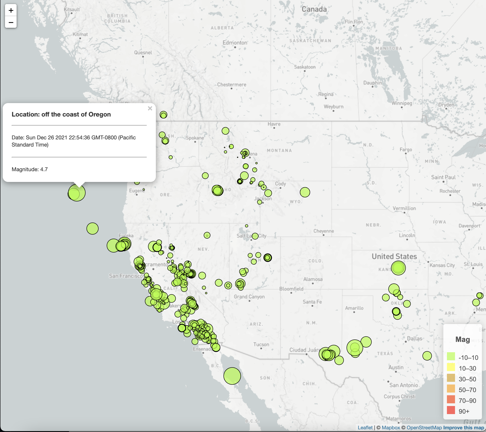

# Leaflet Challenge: Visualizing Data with Leaflet

## Background

Welcome to the United States Geological Survey, or USGS for short. The USGS is responsible for providing scientific data about natural hazards, the health of our ecosystems and environment; and the impacts of climate and land-use change. Their scientists develop new methods and tools to supply timely, relevant, and useful information about the Earth and its processes. As a new hire, you will be helping them out with an exciting new project!

The USGS is interested in building a new set of tools that will allow them to visualize their earthquake data. They collect a massive amount of data from all over the world each day, but they lack a meaningful way of displaying it. Their hope is that being able to visualize their data will allow them to better educate the public and other government organizations (and hopefully secure more funding) on issues facing our planet.

## My Task

### Level 1: Basic Visualization

1. **Get Data**

   

   The USGS provides earthquake data in a number of different formats, updated every 5 minutes. Visited the [USGS GeoJSON Feed](http://earthquake.usgs.gov/earthquakes/feed/v1.0/geojson.php) page and selected the JSON dataset "All Earthquakes from the Past 7 Days." I used the URL of this JSON to pull in the data for our visualization. Also, I made sure to get an API from [Mapbox](https://www.mapbox.com). 

2. **Import & Visualize the Data**

   Create a map using Leaflet that plots all of the earthquakes from the dataset based on their longitude and latitude.

   * Data markers reflect the magnitude of the earthquake by their size and and depth of the earthquake by color. Earthquakes with higher magnitudes appear larger and earthquakes with greater depth appear darker in color.

   * Includes popups that provide additional information about the earthquake when a marker is clicked.

   * Created a legend that will provide context for the mapped data.

   * Visuluations looks as follows:

   

- - -

### Assessment

Final product will be assessed according to [this grading rubric](https://docs.google.com/document/d/1kDNeT4a54ik_AZrHYN3LmVMqH0hDuiwbK2h5lHNxumQ/edit)

___
© 2021  Trilogy Education Services, a 2U, Inc. brand. All Rights Reserved.	
